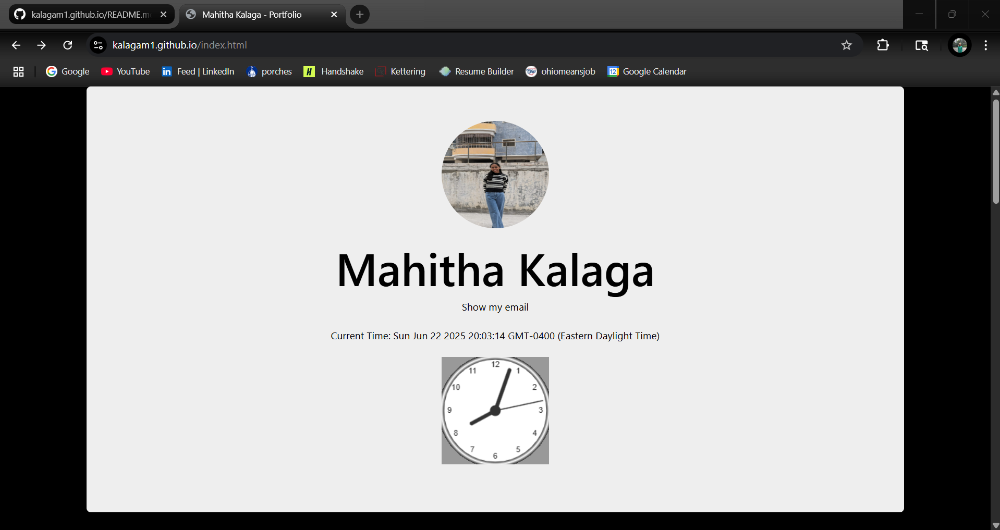

# Web Application Programming and Hacking

## Instructor: Dr. Phu Phung

## Student

**Name**: Mahitha Kalaga

**Email**: [kalagam1@udayton.edu](kalagam1@udayton.edu)

## Repository Information

Repository's URL: [https://github.com/kalagam1/kalagam1.github.io](https://github.com/kalagam1/kalagam1.github.io)

This is a private repository for Mahitha Kalaga to store all the code from the course. The organization of this repository is as follows.

### Labs

[Hands-on exercises in Lectures](labs)

- [Lab 0](labs/lab0): Development Environment Setup
- [Lab 1](labs/lab1): Foundations of the Web
- [Lab 2](labs/lab2): Front-end Web Development

### Hackathons

- [Hackathon 1](hackathon1): Cross-site Scripting Attacks and Defenses

### Individual Projects

- [Individual Project 1](https://github.com/kalagam1/kalagam1.github.io): Front-end Web Development with a Professional Profile Website and API Integration on github.io cloud service

## Report

## The Project's overview

This project involved creating and deploying a professional profile website on GitHub Pages as part of the "Web Application Programming and Hacking" course. The website showcases my education, experiences, technical skills, and cybersecurity interests. Key features include the use of Bootstrap, JavaScript-based interactions, public API integrations, and a dedicated page introducing the WAPH course with related lab and project work.

Project's URL: [Project 1](https://kalagam1.github.io)

## Task 1: General requirements

I built a personal portfolio website that highlights my academic background, technical skills, and career goals in cybersecurity. The website was created using semantic HTML5 structure and styled with Bootstrap to ensure responsiveness across devices. I included all required elements such as my full name, headshot (150x150 pixels), email address, a brief biography, and a downloadable resume. Furthermore, I created a separate HTML page (waph.html) that introduces the "Web Application Programming and Hacking" course. This page outlines the labs, hackathons, and project work completed as part of the course and links back to the main profile for easy navigation.

### Task 2: Non-technical requirements

I chose Bootstrap 5 as the CSS framework for this project to ensure a clean, modern design and consistent layout across different screen sizes. Using Bootstrap's grid system and built-in components like cards, buttons, and typography, I developed a user-friendly interface suitable for employers and recruiters. To make the website feel more professional, I kept the color scheme dark with contrasting text. I also integrated a visitor tracking feature using FlagCounter, which visually displays country-based page view stats at the bottom of the site, serving as a basic analytics tool.

## Task 3: Professional requirements

### JavaScript Code 

I implemented several interactive features to enhance user experience. The digital clock was created using JavaScript's Date object and setInterval() function, which updates every second. This clock is displayed on the homepage and serves as a dynamic element that indicates real-time updates. The analog clock, styled with a canvas, was implemented using the clock.js script provided in the lecture.

To protect personal information, I used jQuery to add a show/hide functionality for the email address. Clicking the link toggles visibility of the email using a fade effect. As an additional feature, I implemented a visit-tracking cookie. On first-time visits, users are greeted with a welcome message. For returning users, the page displays the timestamp of their last visit, helping to personalize their experience while demonstrating my understanding of JavaScript cookies and DOM manipulation.

### Public Web APIs Integration

I added two dynamic data sources. First, I used the JokeAPI to fetch a random programming joke every 60 seconds. The jokes are displayed inside a paragraph element on the homepage. This was implemented using the fetch() function along with setInterval() to refresh the content periodically.

I included the XKCD comic API to display a comic image and its title. Due to cross-origin restrictions, I used a CORS proxy (api.allorigins.win) to access the data without error. I created a visually prominent section on the site to show the latest comic, which is updated dynamically using JavaScript. I also included an appropriate disclaimer that makes it clear that the content is generated by third-party services and I am not responsible for their data.

### JavaScript Cookies

To track returning visitors, I implemented a client-side cookie system using native JavaScript. When a user first visits the website, a cookie is set with the current date and time. Upon subsequent visits, the script reads this cookie and displays a welcome back message along with the stored timestamp of the last visit. This was achieved using document.cookie along with custom logic to parse and update the stored value. This feature demonstrates my understanding of persistent client-side data handling and enhances user personalization.

